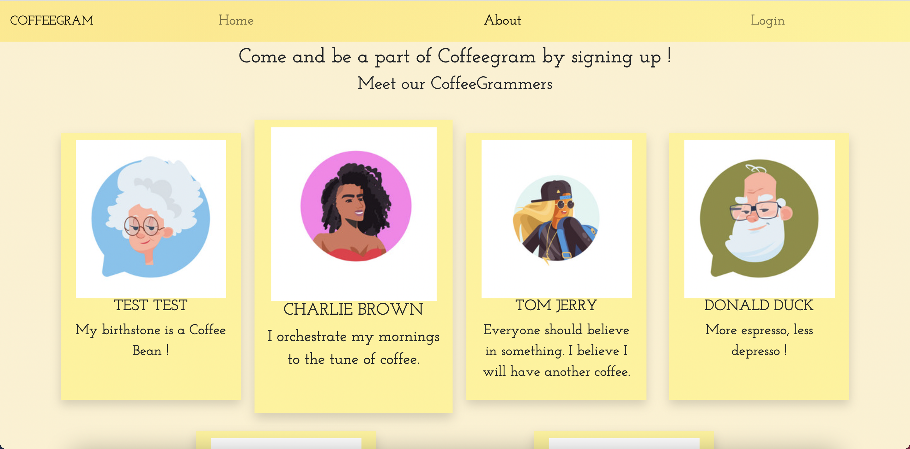

<h1 align="center">CoffeeGram</h1>
<p align="center">


</p>

<div align="center" width="50">
  
</div>

<h3 align="center">CoffeeGram is a web-based application, a community of people who share their common love for Coffee and Cafes. Here you can browse through an exclusive list of Cafes in different cities of Netherlands. Also, you can read through short description of cafe, look at the pictures of cafe and view the reviews posted by members of our community.
</h3>


- [See in action here](https://coffeegram.netlify.app/)

---

## The Idea 💡
We go on exploring different cities of Netherlands on weekend and are always looking for some good cafes to have our favorite cup of Capuccino. So I thought I should build an app which will have an exclusive collection of cafes reviewed by people who love coffee ! Being a signed up member of CoffeeGram, you can add cafes to list and also post reviews for it. I hope this app helps people who love coffee and some more coffee !

---

## Features
- Ability to view cafes in different cities of Netherlands(currently Amsterdam, Maastricht, Rotterdam, Den Haag, Utrecht)
- Ability to add cafe to list by signing up 
- Ability to view cafe description, pictures, contact details, address and reviews
- Ability to post review for cafe if you are signed up user
- Ability to view cafes reviewed by you, on map

---

## Tools & Technologies
- React JS 
- Axios
- Express 
- Postegres 
- Leaflet map 🍃
- Framer-motion

--- 

## API
- For this project, I have built my own API using express
- [Positionstack API](https://positionstack.com/documentation): For fetching coordinates from address

--- 

## Setup
Clone this repo to your desktop and run `npm install` to install all the dependencies.

---

## Usage
After you clone this repo to your desktop, go to its root directory and run `npm install` to install its dependencies.

Once the dependencies are installed, you can run  `npm start` to start the application. You will then be able to access it at localhost:3000


---

## What Am I Using and Why ?

```
BACKEND:
  - axios                       Fetch user GitHub repos
  - bcryptjs                    Password encryption
  - config                      Storing sensitive information
  - express                     Backend server
  - jsonwebtoken                Securing API endpoints and authorization
  - seqelize                    ORM library to map objects to and from table
  - postgres                    Relational DB to store data

FRONTEND:
  - axios                       Making API calls
  - react-redux                 State management
  - react-router-dom            Routing
  - redux-devtools-extension    Redux DevTools
  - redux-thunk                 Middleware for async actions
  - framer-motion               Page transitions
  - leaflet                     Display cafe on map
  - react-rating-stars          Show ratings as stars
```

---

## Backend 
For this full-stack application, I built my own API tailored to the project requirements. You can check the [Backend Repo](https://github.com/GaurangiM/coffeegram-react-server) to know more about the backend code.

---

## Wireframe 
Here you can view [Wireframe](https://wireframepro.mockflow.com/editor.jsp?editor=on&bgcolor=transparent&perm=Create&ptitle=Cafe%20guide&category=sketchui&projectid=M834acd074bdd167c49e2ef902c71ba271623251319099&publicid=fc2a25a50d484eaaa0d34e340026511d#/page/8d776beb21e540529d86040f39a76779) of the project.

---

## Project Board
Here you can view the [Project Board](https://github.com/users/GaurangiM/projects/1) to see the user stories.

---

## Screenshots and Gif

<h1 align="center">




</h1>

---

## Future scope

- Extend API to accomodate more cities in Netherlands
- Display ratings on Home Page
- Add page scroll animations
- Add Profile page for user